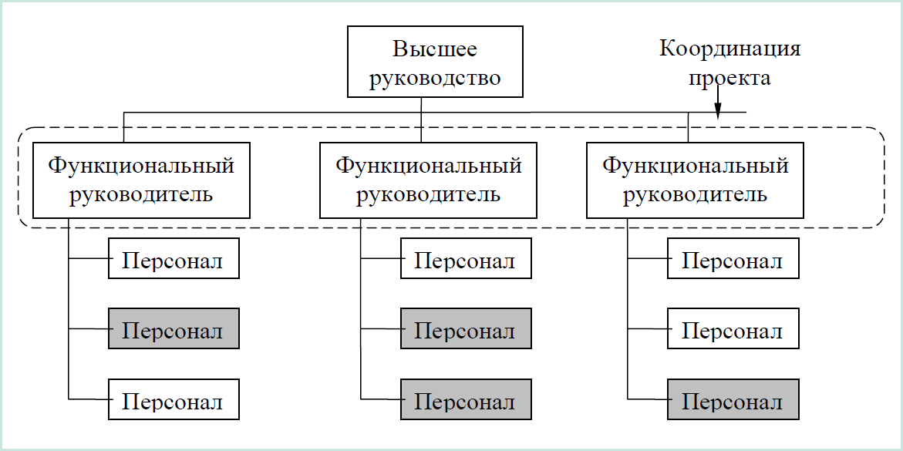
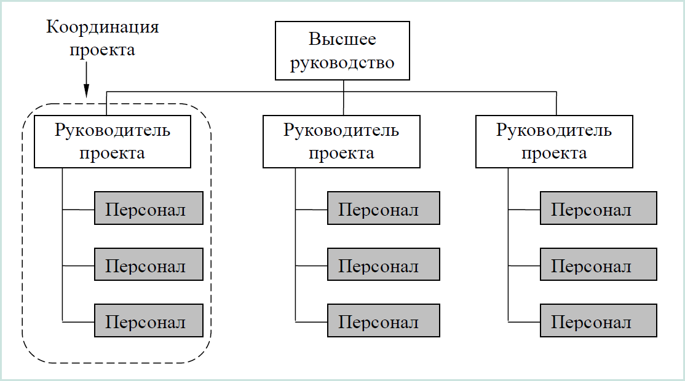
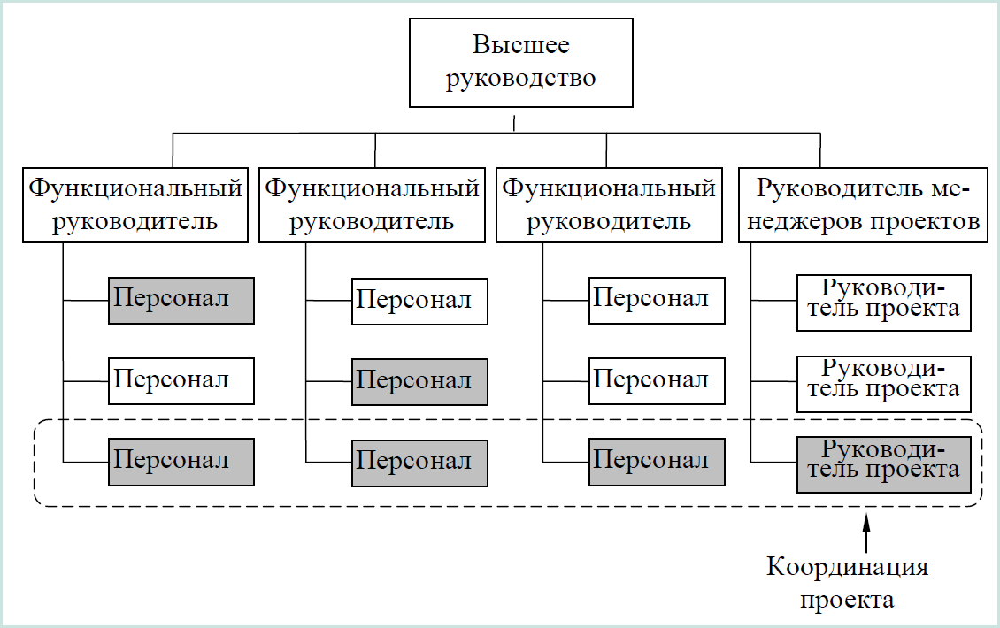
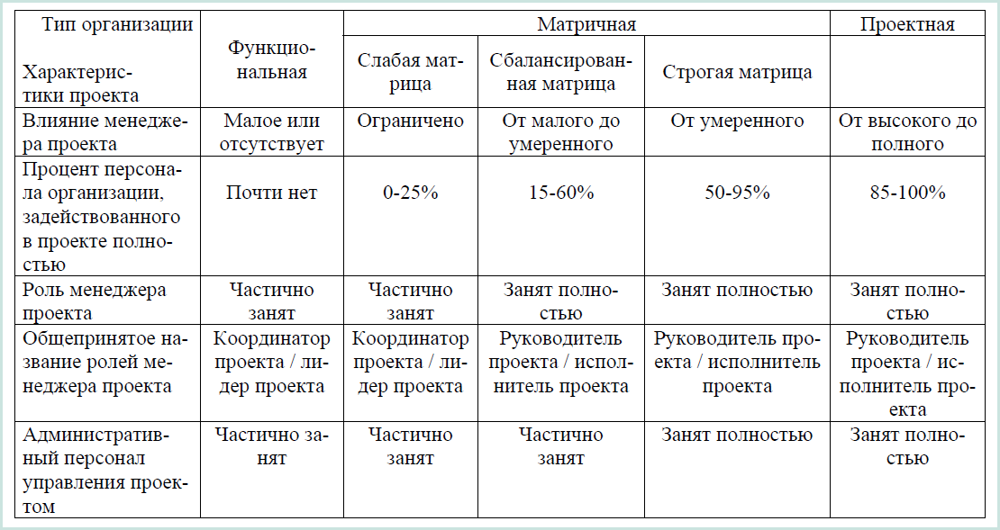

Организационные структуры проекта (Project Organization) – наиболее соответствующая проекту временная организационная структура, включающая всех его участников и создаваемая для успешного достижения целей проекта.

Декомпозиция организационной структуры (Organization Breakdown Structure, OBS) – структурная декомпозиция организации проекта, предназначенная для соотнесения пакетов работ с организационными единицами. OBS является графической диаграммой организационной структуры проекта.

Разработка организационной структуры проекта включает:
- идентификацию всех организационных единиц;
- определение ролей участников проекта и их взаимодействия;
- определение ответственности и полномочий;
- распределение ответственности и полномочий между организационными единицами структуры;
- разработка инструкций, регламентирующих взаимодействие в структуре и рабочие процедуры.

В зависимости от степени интегрированности управления проектами общая организационная структура компании (родительская организация) может быть представлена четырьмя основными типами организационных структур компании (на рисунках затемненные блоки показывают персонал, задействованный в проекте):

функциональная структура (рисунок 16.2);
проектная структура (рисунок 16.3);
матричная структура (рисунок 16.4);
смешанная структура.

Рисунок 16.2 – Функциональная организационная структура

Преимущества функциональной структуры:
- прозрачная система отчетности;
- узкая специализация;
- однородность групп;
- стремление к техническому превосходству.

Недостатки функциональной структуры:
- иерархическая система принятия решений и связи;
- менеджер проекта зависит от влияния персонала;
- границы проекта ограничены предметной областью;
- препятствие для прозрачности перед клиентом;
- ограниченные возможности для профессионального роста;
- трудное вживание в роль.

Рисунок 16.3 – Проектная организационная структура

Преимущества проектной структуры:
- размывание специализации сотрудников;
- ослабление внимания к технической компетентности;
- лидерство непредметных специалистов;
- перенос внимания с технической на административную сторону работы;
- снижение роли функциональных руководителей

Недостатки проектной структуры:
- четкая роль менеджера проекта;
- персонал задействован на 10%;
- четкая ответственность;
- стремление к совместной работе;
- отслеживание затрат и хода работы;
- принятие решений;
- отношения с заказчиком;
- стандартные процессы.

Существуют различные виды матричных систем в зависимости от способа и глубины разграничений полномочий менеджеров проекта и функциональных управляющих. Слабая, легкая или функциональная матрица – это матрица, где баланс полномочий сдвинут в сторону функциональных менеджеров. Сбалансированная или средневзвешенная матрица - это традиционная матричная структура. Сильная, строгая или проектная матрица – это форма близкая к проектной структуре, в которой управляющий проектом контролирует большинство аспектов проекта.

Рисунок 16.4 – Матричная организационная структура

Преимущества матричной структуры:

- для реализации проекта по мере необходимости могут быть использованы ресурсы и персонал клиента;
- порядок работы и система, предусмотренные проектом и клиентом, совместимы;
- полномочия менеджера проекта зависят от того, кому он подчинен;

Недостатки матричной структуры:
- у членов проекта два руководителя;
- баланс сил между клиентом и руководителем проекта может быть неустойчив;
- возможны конфликты при принятии решений;

Линейно-функциональная система
Смешанная, линейно-функциональная структура, характеризуется ступенчатой системой управления. Сначала функциональны руководители доносят задачи до линейных руководителей (начальников отделов, цехов), а затем те распределяют их по исполнителям. В этой структуре линейные руководители не принимают самостоятельных решений, а обрабатывают запросы от функциональных управляющих.

Достоинства структуры:

- чёткое распределение обязанностей;
- ответственность линейных руководителей за качественное управление своими службами, а функциональных директоров — за выполнение целей по направлению;
- высокая производительность и качество работы.

Недостатки:
- большая нагрузка на главного руководителя — необходимость решения как функциональных так и линейных задач;
- одновременное взаимодействие по вертикали и горизонтали усложняет обмен информацией, продлевает сроки согласования вопросов;
- сложно оценить конкретный вклад служб в конечный результат или продукт бизнеса.

Организационная структура проекта – это динамическая структура, которая претерпевает изменения в процессе осуществления проекта. Эти изменения зависят от фаз жизненного цикла проекта, типов используемых в проекте контрактов и других условий выполнения проекта. В ходе развития проекта возможны изменения и самих типов рассмотренных организационных структур.

От организационной структуры организации зависят функциональные обязанности участников проекта, их взаимодействие и ответственность.

При разработке организационной структуры проекта следует учитывать организационную структуру родительской организации, культурные традиции организации, влияние внешней среды и другие факторы.

В таблице 16.1 приведены сравнительные характеристики проекта в зависимости от организационной структуры родительской организации.

Таблица 16.1 – Влияние организационных структур на проекты
